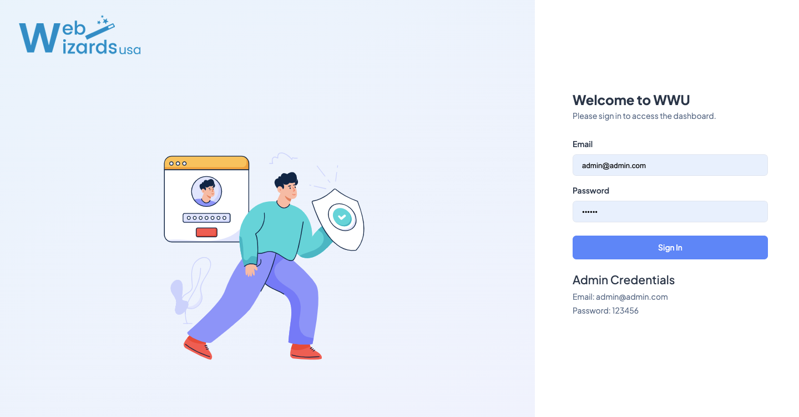
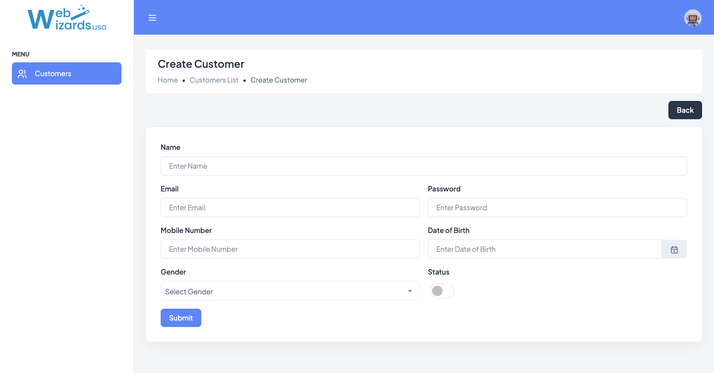
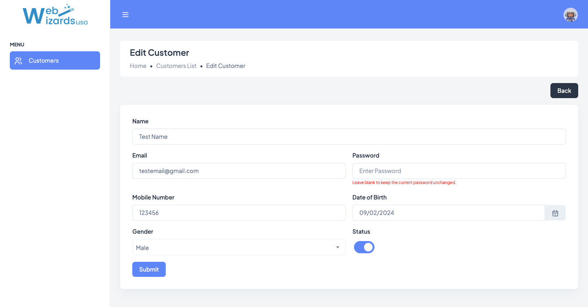
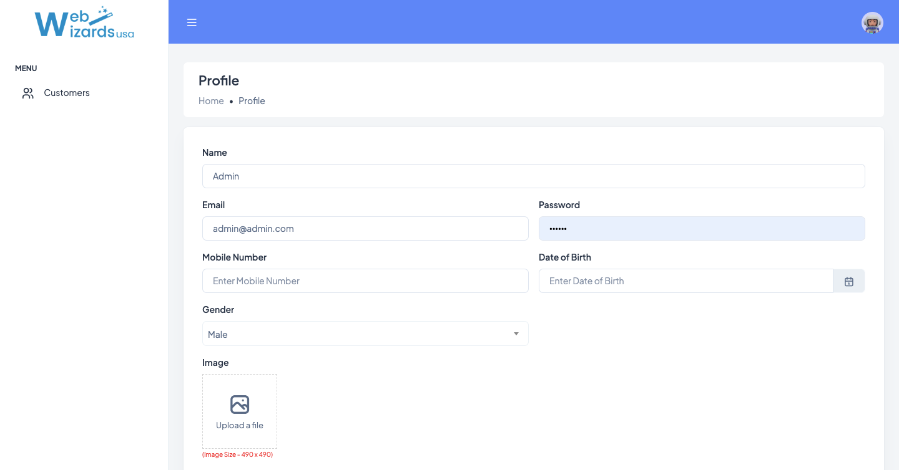

# Laravel Sample Project

This is a basic Laravel application featuring modules for login, customer management, and user profile.

## Installation

Clone the repository using the following command:
```
git clone https://github.com/webwizardsusa/admin-panel.git
```

Navigate to the project directory:
```
cd admin-panel
```

Install the required dependencies:
```
composer install
```

Create an environment file:
```
cp .env.example .env
```

Create the database & Update the .env file with your database credentials by modifying the following parameters:
```
DB_USERNAME
DB_PASSWORD
DB_DATABASE
DB_HOST
```

Run the database migrations and seeders:
```
php artisan migrate:fresh --seed
```

## Run server

Start the Laravel development server using the following command:
```
php artisan serve
```
Then open your browser and navigate to http://localhost:8000 to view the application.

or

```
Create a virtual host for the project
```

## Screenshots

## Login Page


## Customer List


## Create Customer


## Edit Customer


## Profile
